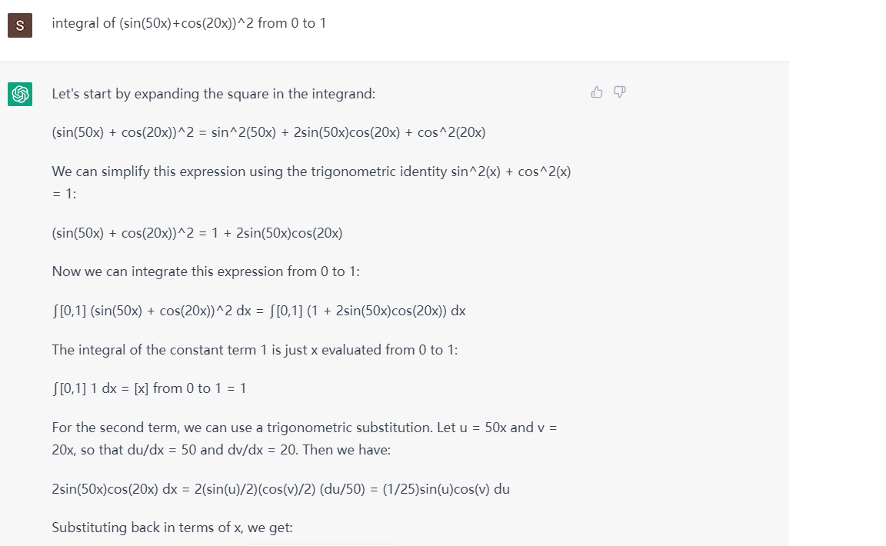
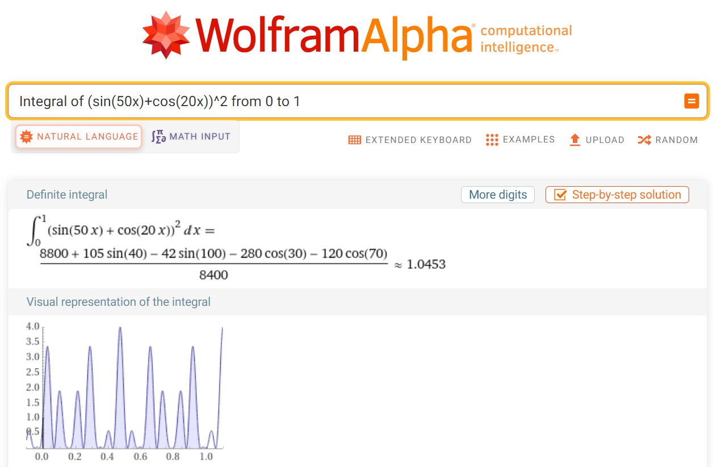

```{r setup, include=FALSE}
knitr::opts_chunk$set(echo = F, fig.align = "center", fig.width = 7)
```

## The integration problem

Integral of (sin(50x)+cos(20x))\^2 from 0 to 1
$$\int_0^1 [sin(50x)+cos(20x)]^2 \, dx$$

There are couple of methods we can use, for instance checking it in WolframAlpha, integrate it analytically, or do it using Monte Carlo method.

First, Let us ask the big boss of chat.GPT. It turns out a disaster:-)


Secondly, Let's try WolframAlpha

- Copy "Integral of (sin(50x)+cos(20x))\^2 from 0 to 1"
- Paste it into [WolframAlpha](https://www.wolframalpha.com/)
- The engine will translate it into a correct math integral, and give it back a number and a very nice visual representation of the integral



## Analytic method

Use your integration skills first, then calculated in r
\begin{align*}
I  =  & \int_0^1 [sin(50x)+cos(20x)]^2 \, dx\\
&=\int_0^1 [sin^2(50x)+cos^2(20x)+2sin(50x)cos(20x)]\, dx\\
&=\int_0^1 [\frac{1-cos(100x)}{2}+\frac{1+cos(40x)}{2}+sin(50x+20x)+sin(50x-20x)]\, dx\\
&=\left[\frac{1}{2}x-\frac{1}{2}\frac{sin(100x)}{100}+\frac{1}{2}x+\frac{1}{2}\frac{sin(40x)}{40}-\frac{cos(70x)}{70}-\frac{cos(30x)}{30}\right]_{x=0}^{x=1}
\end{align*}

```{r}
f<- function(x) {
  x+0.5*(sin(40*x)/40-sin(100*x)/100)-(cos(70*x)/70+cos(30*x)/30)
}

f(1)-f(0)

```

or use the r function of integration

```{r}
integrate(function(x) (sin(50*x)+cos(20*x))^2, lower =0, upper = 1)
```

## Numerical method by Monte Carlo

1.  generate x1, x2,...xn from uniform(a, b)
2.  Compute h(x1), h(x2), ..., h(xn)
3.  Estimate E(h(X)), by averaging h(X)
4.  Estimate the integral I=(b-a)\* average of h(x)

Here h(x)= (sin(50x)+cos(20x))\^2

First define the function, and draw a visual representation of the integral

```{r}
x<- seq(0,1, by = 0.001)
h<- function(x)(sin(50*x)+cos(20*x))^2
plot(x,h(x), type="l")
```
Secondly, let's do it using Monte Carlo

```{r}
set.seed(1) 
n <-10^4 #Set the number of points to generate
x<-runif(n, 0,1) #generate n number of points from uniform (0,1)
h_x<- h(x)
hbar_x <- mean(h(x)) #compute h(x), and the mean of h(x)
(I = 1*hbar_x) #mean times the interval = integral
```

Third step, how much variation of the hbar_x becomes as we increase the number of n.
```{r}
n <- 10^4
hbar_n <-cumsum(h_x[1:n])/1:n # to compute cumulative mean of h(x)

#To estimate variance of hbar_m
var_m <- function(m){
  sum((h_x[1:m]-hbar_n[m])^2)/m^2
}

v_n <- apply(matrix(1:n),1,var_m)

se_n <- sqrt(v_n)

plot(1:n,hbar_n, type = "l")

lines(hbar_n+1.96*se_n, col = "blue")

lines(hbar_n-1.96*se_n, col = "blue")
```

## Importance sampling example

```{r}
n <- 10000
x <- rnorm(n, 10, 3)
w_star <- dgamma(x, 8) / dnorm(x, 10, 3) 
mu_hat_IS <- (cumsum(x * w_star) / (1:n))
mu_hat_IS[n]  # Theoretical value = 8
```
